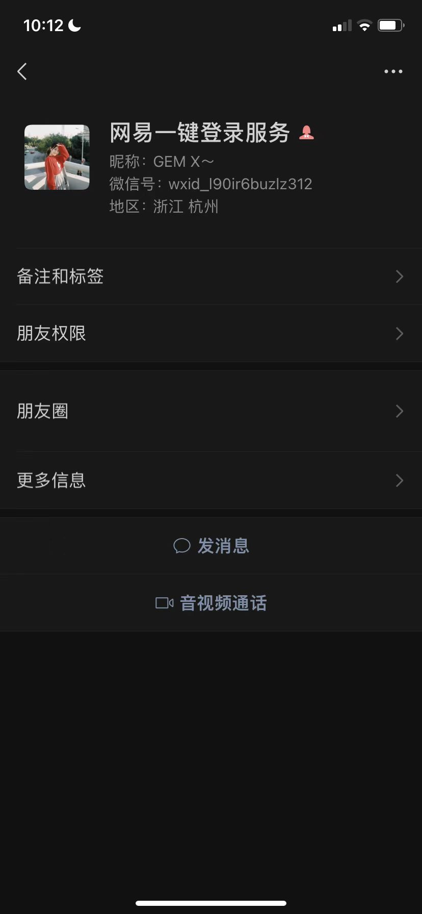
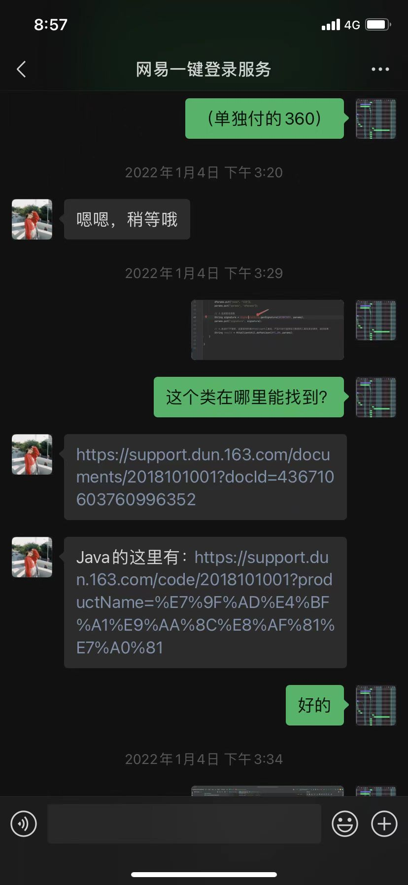

# sensitive-words-filter（alex-words-filter）
# Java版本的高性能敏感词过滤包
1. 通过多叉搜索树结构存入敏感词词库和正向词汇词库及分值;
2. 当正向词汇与敏感词汇重叠时，如果正向词汇的分值高于敏感词词汇则认为是正向词汇；
3. 当正向词汇与敏感词汇重叠时，如果敏感词词汇的分值高于正向词汇则认为是敏感词；
4. 代码会返回所有搜索到的敏感词汇及过滤结果。

# 附言：开发网站绝对不要采用网易易盾的组件，原因如下：

